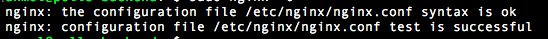
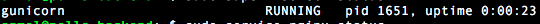

Deploy a Python Application( django-app ) using gunicorn, nginx, and supervisord
------------------------------------------------------------------------------------------------------------

This chapter tells the basics of deploying a `django application <https://www.djangoproject.com/>`_ using gunicorn, nginx and supervisord.

Prerequisites 
+++++++++++++++++

.. Knowledge
.. <<<<<<<<<<<<

Knowledge
~~~~~~~~~~~~~~~
+ Django basics 
+ (Optional) finish the book about `django-rest-apis      <https://books.agiliq.com/projects/django-api-polls-tutorial/en/latest/>`_  .

Resources
~~~~~~~~~~~~~~~
A Unix server for deploying the app , connected with a SSH(preferred).

++++++++++++++++++++++++++++

`Django <https://www.djangoproject.com/>`_  is a free and open source web application framework, written in Python. Django has a lot of inbuilt set of components that helps you to develop websites faster and easier.

`Gunicorn <http://gunicorn.org/>`_   is  a simple, light-weight Python WSGI HTTP Server for UNIX.  `WSGI <http://wsgi.readthedocs.io/en/latest/>`_  is the Web Server Gateway Interface. It is a specification that describes how a web server communicates with web applications, and how web applications can be chained together to process one request.

`Nginx <https://www.nginx.com/>`_ is a high-performance HTTP server, reverse proxy, load balancer and static files loader.

`Supervisord <http://supervisord.org/>`_ is a process-control system which allows us to monitor and control a number of processes on UNIX operating system.

<<<<<<<<<<<<<<<<<<<<<<<<<<<<<<<<<<<<

Let's start with our server
~~~~~~~~~~~~~~~~~~~~~~~~~~~~~~

Once we create our server and get connected to it via SSH, then to log in to that server we have to do 

.. code-block:: shell

    $ ssh root@IP_ADDRESS_OF_SERVER

This will get us connected with the server.

Now we have to install the prerequisites, run these commands 

.. code-block:: shell

    $ sudo apt-get update
    $ sudo apt-get install git python-pip python-dev virtualenv virtualenvwrapper 
    $ sudo apt-get install postgresql postgresql-contrib
    $ pip install --upgrade pip

Now let’s `configure the virtual-env wrapper <https://books.agiliq.com/projects/essential-python-tools/en/latest/environment_management.html#virtualenvwrapper>`_

After setting-up the virtualenvwrapper, create a virtualenv

.. code-block:: shell

    $ mkvirtualenv env-name

From within our virtual-env, install:

.. code-block:: shell

    (env-name) $ pip install django gunicorn psycopg2

Let's clone the repo in home folder, pull the application from Git, we use this repo https://github.com/anmolakhilesh/django-polls-rest

.. code-block:: shell

    $ cd /home/
    $ git clone https://github.com/anmolakhilesh/django-polls-rest
    
Now we have to add permissions to the :code:`manage.py`  file

.. code-block:: shell

    $ cd /django-polls-rest/
    $ chmod 755   manage.py 

Now install the requirements

.. code-block:: shell

    (env-name) $ pip install -r requirements.txt

Now set up PostgreSQL    

Create a file :code:`.env` and add these lines in that

.. code-block:: shell

        export POSTGRES_DB = pollsdb
        export POSTGRES_USER = polls_admin
        export POSTGRES_PASSWORD = polls_password
        export POLLSAPI_PG_HOST = 127.0.0.1

Create a postgres Database

.. code-block:: shell
    
    sudo -u postgres psql

After running the above function, we will be logged inside PostgreSQL terminal, now lets create our db and user

.. code-block:: shell

        > CREATE DATABASE pollsdb; 
        > CREATE USER polls_admin WITH PASSWORD 'polls_password'; 
        > ALTER ROLE polls_admin SET client_encoding TO 'utf8'; 
        > ALTER ROLE polls_admin SET default_transaction_isolation TO 'read committed'; 
        > ALTER ROLE polls_admin SET timezone TO 'UTC'; 
        > ALTER USER polls_admin CREATEDB; 
        > GRANT ALL PRIVILEGES ON DATABASE pollsdb TO polls_admin;
        
        > \q   # to quit the shell

Make sure that these details match the details in the :code:`.env` file. Exit the PostgreSQL shell by typing :code:`\q` .

Now as the DB is ready , we can run migrations command inside the repo folder.

.. code-block:: shell

    (env-name) $ python manage.py makemigrations
    (env-name) $ python manage.py migrate
    
    # Create a superuser  
    (env-name) $ python manage.py createsuperuser

<<<<<<<<<<<<<<<<<<<<<<<<<<<<<<<<<<<<

Using gunicorn 
~~~~~~~~~~~~~~~~~~~~~~~~~~~~~~

.. code-block:: shell

    (env-name) $ pip install gunicorn

After installing gunicorn , now run it 

.. code-block:: shell

    # starts the server 
    (env-name) $ gunicorn polls_rest.wsgi

It will run the app , we can check  :code:`IP_ADDRESS_OF_SERVER:8000` , :code:`IP_ADDRESS_OF_SERVER:8000/admin` .
It will not have any css , as the gunicorn only serves the application. We can server static files using `nginx` .

To exit it press :code:`Ctrl+C` .

.. code-block:: shell    

    # starts the server by binding it to a specific port
    (env-name) $ gunicorn --bind 0.0.0.0:8888 polls_rest.wsgi

    # running with a config file
    (env-name) $ gunicorn -c /path/to/config/file polls_rest.wsgi

    # running in daemon mode
    (env-name) $ gunicorn --daemon polls_rest.wsgi

If it is in daemon-mode, then exit it with :code:`pkill gunicorn` , which will kill the gunicorn process.

To have a `gunicorn config file <http://docs.gunicorn.org/en/stable/configure.html#configuration-file>`_ for gunicorn , we write the config file in a :code:`.py` .

Using nginx
~~~~~~~~~~~~~~~~~~~~~~~~~~~~~~
By using gunicorn, we were able to run the application, but without styles as the gunicorn only runs the application and does not serve the static files, and django does not serve static file except in development.

We will use :code:`nginx` to serve the static files , nginx will first get the request, and it will send it to gunicorn. 

To install nginx

.. code-block:: shell   

    $ sudo apt-get install nginx

Now we have to configure nginx to tell it what to do.

So, **create a file** :code:`/etc/nginx/sites-available/pollsapp` and add the following 

.. code-block:: shell   

    server {
        listen 8000;
        server_name SERVER_DOMAIN_OR_IP_ADDRESS_OF_SERVER;

        location = /favicon.ico { access_log off; log_not_found off; }

        location /static/ {
                root /home/django-polls-rest;
        }

        location / {
                include proxy_params;
                proxy_pass http://unix:/home/django-polls-rest/polls_rest.sock;
        }
    }

In the first and the secound line we are mentioning the port :code:`8000` and the server where the nginx app should listen to.
and the third line is telling the nginx, to ignore any errors related to the favicon.
The fourth line tells, static files will have a standard URI prefix of :code:`static/` and should be looked for in :code:`~/django-polls-rest/static/` folder.
and the last location block tells the socket(gunicorn socket) to communicate.

After this, we have to enable this file by linking the the :code:`sites-enabled` folder.

The path :code:`/home/django-polls-rest` will be the application path.

.. code-block:: shell  

    $ ln -s /etc/nginx/sites-available/pollsapp /etc/nginx/sites-enabled

We link the above file  to :code:`sites-enabled` because that will be included in the main nginx settings file :code:`/etc/nginx/nginx.conf`

After enabling the config file , we can check nginx configuration by 

.. code-block:: shell  

    $ sudo nginx -t

If the configuration file is correct , then we should see this

Now we have to mention the static files of our app in the :code:`settings.py`   file . So add this line in `settings.py`

.. code-block:: python  

    STATIC_ROOT = os.path.join(BASE_DIR, 'static/')

After adding this line, we have to perform run :code:`collectstatic` command 

.. code-block:: shell

    (env-name) $ python manage.py collectstatic
    

Let's run the app

.. code-block:: shell

    (env-name) $ gunicorn --daemon --workers 3 --bind  unix:/home/django-polls-rest/polls_rest.sock polls_rest.wsgi

The :code:`/home/django-polls-rest/polls_rest.sock` file is a unix-socket file will be created automatically. 
And this file will enable Gunicorn and Nginx to communicate to each other.    
    

Now Restart Nginx for changes to take effect.

.. code-block:: shell

    $ sudo service nginx restart

This will run our app in the :code:`http://IP_ADDRESS` 

 Point to remember , check :code:`ALLOWED_HOSTS` in  :code:`settings.py` to have you host name or ip address.

 
Let's us Supervisord
~~~~~~~~~~~~~~~~~~~~~~~~~~~~~~
`Supervisor <http://supervisord.org/>`_ is a process monitoring tool, which can restart any process if the process dies or gets killed for some reason.

At present we are manually starting gunicorn in daemon to run our app, Suppose if this gunicorn process closes or gets killed , then we have to manually start it again.
To automate the process of restarting we use `Supervisord`, So that supervisor controls the gunicorn process.

To install supervisord

.. code-block:: shell

    $ sudo apt-get install supervisor

Let's add a configuration file :code:`pollsapi.conf` for our application in :code:`/etc/supervisor/conf.d/` folder,
the :code:`conf.d` folder will have all our config files.

.. code-block:: shell

    [program:pollsapi]
    directory=/home/django-polls-rest/polls_rest 
    command=/home/.virtualenvs/demo-polls-1/bin/gunicorn --workers 3 --bind unix:/home/django-polls-rest/polls_rest.sock polls_rest.wsgi
    autostart=true
    autorestart=true
    stderr_logfile=/var/log/pollsapi.err.log
    stdout_logfile=/var/log/pollsapi.out.log

Let's understand the config file we have written,

:code:`[program:pollsapi]` this tells us that the program name is `pollsapi`

This name is used in commands like

.. code-block:: shell

    $ sudo supervisorctl start myproject

The :code:`directory` tells us the path to our project.

The :code:`command` is the command to start our project

And :code:`autostart` tells the application to start on system boot and :code:`autorestart` will restart the app when it closes for some reason.

:code:`stderr_logfile` which will have the error logs & :code:`stdout_logfile` will have non-error logs.

Now to save the file, run these command

.. code-block:: shell

    $ sudo supervisorctl reread
    $ sudo supervisorctl update
    $ sudo supervisorctl reload

We have just updated and reloaded the supervisor .

.. code-block:: shell

    $ sudo supervisorctl status

This will show 

To check gunicorn processes 
    
.. code-block:: shell    
    
    $ ps ax | grep gunicorn

To check if the app is serving by gunicorn , do curl

.. code-block:: shell  

    $ curl 0.0.0.0:8000

let’s restart our nginx 

.. code-block:: shell  

    $ systemctl restart nginx

Now our app should be running on :code:`http://IP_ADDRESS_OF_SERVER`