Google Cloud Platform
=====================

`Google Cloud Platform(GCP) <https://console.cloud.google.com/>`__ is a
suite of cloud computing services offered by Google.

The platform includes a range of hosted services for compute, storage
and application development that run on Google hardware. Google Cloud
Platform services can be accessed by software developers, cloud
administrators and other enterprise IT professionals over the public
internet or through a dedicated network connection.

The core cloud computing products in Google Cloud Platform include:

-  **Google Compute Engine**, is an infrastructure-as-a-service (IaaS)
   offering that provides users with virtual machine instances for
   workload hosting.

-  **Google App Engine**, is a platform-as-a-service (PaaS) offering
   that gives software developers access to Google's scalable hosting.
   Developers can also use a software developer kit (SDK) to develop
   software products that run on App Engine.

-  **Google Cloud Storage**, is a cloud storage platform designed to
   store large, unstructured data sets. Google also offers database
   storage options, including Cloud Datastore for NoSQL nonrelational
   storage, Cloud SQL for MySQL fully relational storage and Google's
   native Cloud Bigtable database.

-  **Google Kubernetes Engine**, is a managed, production-ready
   orchestrated environment for deploying containerized applications
   that run within Google's public cloud. It brings our latest
   innovations in developer productivity, resource efficiency, automated
   operations, and open source flexibility to accelerate your time to
   market.

Let us see an example tutorial below which deploys a django application on GCP using Kubernetes

This tutorial should help to deploy a django application on a Kubernetes
Cluster. Before starting this tutorial, the user is expected to have
basic knowledge of GKE, Django, PostgreSQL and Docker

Understanding Kubernetes
------------------------

Before we jump into the tutorial, lets have a basic understanding of
what kubernetes is and how will it be useful for us to deploy our django
application.

What is Kubernetes?
~~~~~~~~~~~~~~~~~~~

**Kubernetes**, at its basic level, is a system for running &
co-ordinating containerized applications across a cluster of machines.
It is a platform designed to completely manage the life cycle of
containerized applications and services using methods that provide
predictability, scalability, and high availability.

To know more about kubernetes, visit
`here <https://www.digitalocean.com/community/tutorials/an-introduction-to-kubernetes>`__

Moving on, as a part of this tutorial we'll be deploying Polls API, from
`here <https://www.github.com/yvsssantosh/django-polls-rest>`__

Local Deployment of Polls API
~~~~~~~~~~~~~~~~~~~~~~~~~~~~~

Let's first clone our sample django application from

::

    git clone https://github.com/yvsssantosh/django-polls-rest.git

Just to make sure we're on master branch, run the command
``git checkout master``

To test the application locally, let's create a virtual environment, and
test the server

::

    # Creating a virtual environment
    mkvirtualenv pollsapi

    # Installing current project requirements
    pip install -r requirements.txt

    # Connect to postgres
    export POSTGRES_USER=pollsdb
    export POSTGRES_DB=polls_admin
    export POSTGRES_PASSWORD=polls_password
    export POLLSAPI_PG_HOST=127.0.0.1

    # Running migrations
    python manage.py migrate

    # Start the local server
    python manage.py runserver 0.0.0.0:8000

Now that we have tested on local server, lets create a new kubernetes
cluster and deploy our application on it.

Setting up Google Cloud SDK
~~~~~~~~~~~~~~~~~~~~~~~~~~~

For instructions to setup Google Cloud SDK navigate to
https://cloud.google.com/sdk

Read the installation instructions and setup accordingly. Once done,
check the installation status by running the command

::

    $ gcloud -v

It should show an output similar to this:

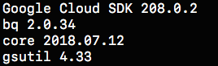

Setting up kubectl command line
~~~~~~~~~~~~~~~~~~~~~~~~~~~~~~~

To manage and maintain a kubernetes cluster from our desktop/laptop we
need to setup kubectl command line. It can be done using the command

::

    gcloud components install kubectl

Once the installation finishes, we should see something like this:
|image0|

Creating a kubernetes cluster
~~~~~~~~~~~~~~~~~~~~~~~~~~~~~

Navigate to ``https://console.cloud.google.com``. Select an existing
project or create a new one, based on requirement.

Then click on Kubernetes Engine from the navigate menu which would
result in the following page

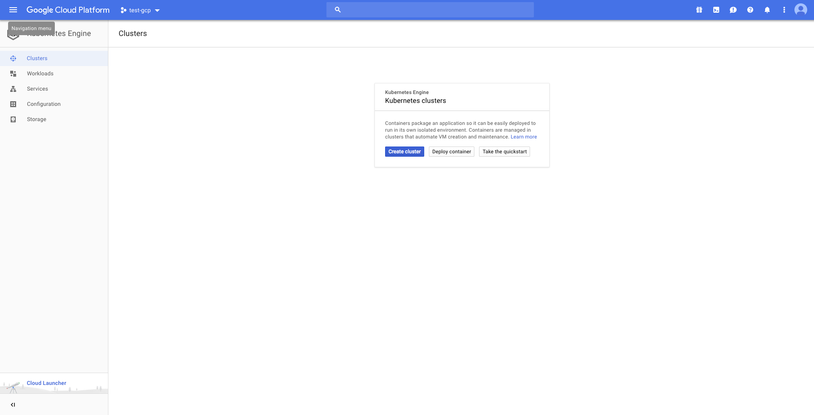

Create a new cluster. I've created a cluster based on the following
settings

::

    Cluster name        :   pollsapi
    Location            :   Zonal
    Zone                :   asia-south1-a
    Cluster Version     :   1.9.7-gke.3 (default)
    Machine Type        :   Small (1 shared CPU with 1.7GB Memory)
    Node Image          :   Core OS (cos)
    Size                :   2
    Boot Disk Size      :   20GB per Node

    #######################################################################################
    ## Only for testing purposes as preemptible nodes are NOT recommended for Production ##
    #######################################################################################

    Preemptible Nodes   :   Yes

``Please be patient as it takes some time to create the cluster``

Once the cluster is created, we'll be able to see a tick mark beside the
name of the cluster.

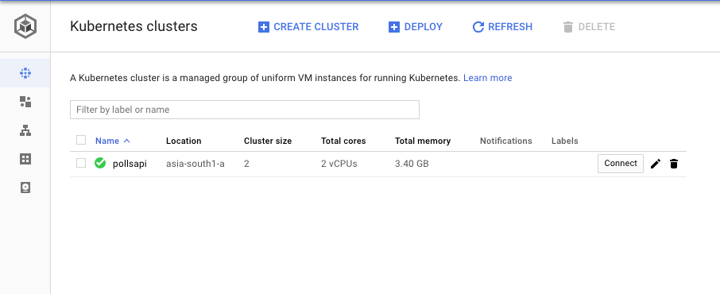

Now click on ``Connect`` and copy the command shown, and paste it in
terminal.

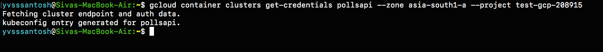

Once connected run the command ``kubectl get all``.

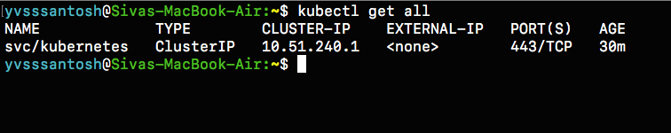

Now that the cluster is up and running, lets package our application
into a containerized one using docker.

Setting up Google Container Registry using Docker
~~~~~~~~~~~~~~~~~~~~~~~~~~~~~~~~~~~~~~~~~~~~~~~~~

Configuring docker with gcloud:

.. code:: sh

    gcloud auth config-docker

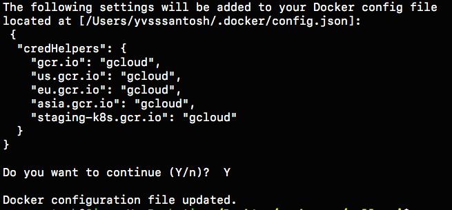

Once docker is configured, we are ready to build the image.

.. code:: sh

    # Build the image
    # Common format to push an image to google container registry is gcr.io/$PROJECT_ID/$IMAGE_NAME:$TAG

    export PROJECT_ID=YOUR_PROJECT_ID_HERE
    export IMAGE_NAME=YOUR_IMAGE_NAME_HERE
    export TAG=YOUR_IMAGE_TAG (optional, default is `latest`)

    # In my case, giving the tag as v1.0.0 (default is latest)
    docker build -t gcr.io/test-gcp-208915/pollsapi:v1.0.0 . 
    # (Note the . in the end)

    # Push the image
    docker push gcr.io/test-gcp-208915/pollsapi:v1.0.0

Once the image has been pushed, paste the push URL in browser. It will
ask you to sign in into google account which has been used to configure
this cluster (if not already signed in).

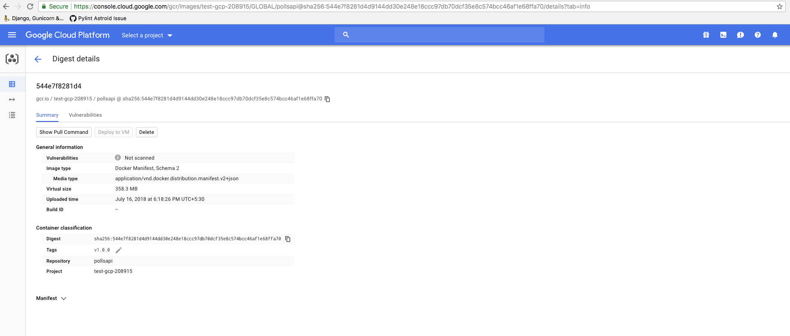

Since our image has been uploaded sucessfully, we need to setup the
database next.

Setting up Helm Package Manager
~~~~~~~~~~~~~~~~~~~~~~~~~~~~~~~

The simplest way of setting up PostgreSQL on kubernetes is with the help
of `Helm Package Manager <https://github.com/kubernetes/helm>`__

For mac users, the command to install helm (using brew) is:

.. code:: sh

    # Install Helm
    brew install kubernetes-helm

    # Setup Helm
    helm init

-  ``Note``: Often during package installation i.e.,
   ``helm install --name MY_RELEASE stable/PACKAGE_NAME`` a common error
   is generated explaining tiller not having access to create cluster
   role bindings. This usually happens if the user logged inside Google
   Cloud SDK doesn't have proper access to create role bindings or
   issues with helm installation.

If that error occurs, then run the following commands:

.. code:: sh

    # Completely uninstall helm
    helm reset --force

    # Remove directories created by helm
    sudo rm -r ~/.helm

Once helm is completely removed, create a clusterrolebinding and a
serviceaccount for helm using the code below

``rbac-config.yaml``

.. code:: yaml

    apiVersion: v1
    kind: ServiceAccount
    metadata:
      name: tiller
      namespace: kube-system
    ---
    apiVersion: rbac.authorization.k8s.io/v1beta1
    kind: ClusterRoleBinding
    metadata:
      name: tiller
    roleRef:
      apiGroup: rbac.authorization.k8s.io
      kind: ClusterRole
      name: cluster-admin
    subjects:
      - kind: ServiceAccount
        name: tiller
        namespace: kube-system

Create a file named rbac-config.yaml and run the following using kubectl
command line

.. code:: sh

    # Creating Service Account and ClusterRoleBinding Tiller
    kubectl create -f rbac-config.yaml

Once this is sucessfully done, initialize helm using

.. code:: sh

    helm init --service-account tiller

And then run the command to install Postgresql in our cluster, as
previously mentioned.

Setting up PostgreSQL
~~~~~~~~~~~~~~~~~~~~~

Before we setup PostgreSQL, lets create a namespace ``databases``

.. code:: sh

    # Why create namespace databases?
    # This command is totally optional, but this is prefered this because I place all the 
    # databases created in a single namespace so that they'll be easy to access.
    kubectl create namespace databases

    # Before creating PostgreSQL using helm, lets understand few basics.

    # Default command of creation enables Persistent Volume Claim (PVC)
    # Instead of default postgres username, we are setting custom user.
    # So replace YOUR_POSTGRES_USER with desired username, in my case polls_admin &
    # MY_RELEASE_NAME, which in my case is pollsdb &
    # MY_DATABASE_NAME, which in my case is pollsdb

    # helm install --name MY_RELEASE_NAME stable/postgresql --set postgresUser=YOUR_POSTGRES_USER,postgresDatabase=MY_DATABASE_NAME --namespace databases

    helm install --name pollsdb stable/postgresql --set postgresUser=polls_admin,postgresDatabase=pollsdb --namespace databases

    # If user wishes not to have a separate namespace then just ignore the last two words
    # i.e. --namespace databases

For more options on customizing postgres with custom parameters, see
`here <https://github.com/kubernetes/charts/tree/master/stable/postgresql>`__

|image1| **DO NOT FORGET to take a note of PGPASSWORD as seen in the
NOTES section (above image) once postgres has been created**

.. code:: sh

    # Saving password of PostgreSQL into environemt varialble $PGPASSWORD
    PGPASSWORD=$(kubectl get secret --namespace databases pollsdb-postgresql -o jsonpath="{.data.postgres-password}" | base64 --decode; echo)

    # Why save the password?
    # Since we have created a separate namespace for databases, secrets from one namespaces cannot be accessed from another
    # So in order to access the postgres password in the default namespace, we must create a new secret
    # Let's first convert our password into base64 encoding.

    echo -n $PGPASSWORD | base64

    # MUST DO : Copy the generated value and replace it with `YOUR_ENCODED_PASSWORD` in the `polls-password-secret.yml`. Then create the secret.

    kubectl create -f pollsdb-password-secret.yml

    # Now that the secret has been setup, lets migrate the data.
    kubectl create -f polls-migration.yml

    # Wait for a minute and check the status of the migration using folling commands.
    kubectl get jobs

    # In order to check the logs, identify the pod running the pod running migration.
    kubectl get pods --show-all

    # Check the logs of the pod
    # kubectl logs POD_NAME
    kubectl logs polls-migration-5tf8z

    # Since the jobs have passed, there is no need for them to exist.
    # We can just delete the jobs using
    kubectl delete -f polls-migration.yml

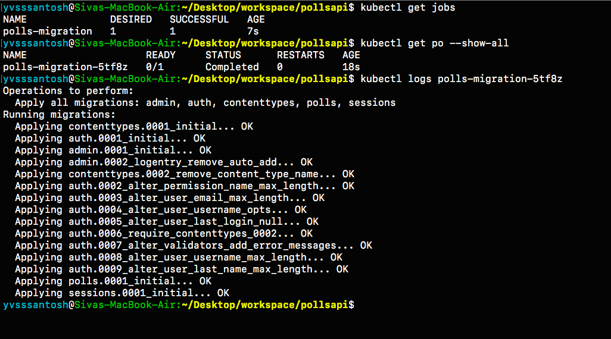

Serving Static Files
~~~~~~~~~~~~~~~~~~~~

Now that we have the database up and running with our migrations, lets
setup our static files. Rather than setting up a separate NGINX server
to serve static files, it'd be much simpler, secure & faster to use
Google Cloud Storage as a provider to serve static files.

Let's first create a bucket in Google Cloud Storage. Visit
https://console.cloud.google.com/storage

``Make sure to the check if the right project is selected.``

I've created a bucket using the following settings:

::

    Name of Bucket          :   pollsapi-storage
    Default Storage Class   :   Regional
    Location                :   asia-south1 (Closest to my location)

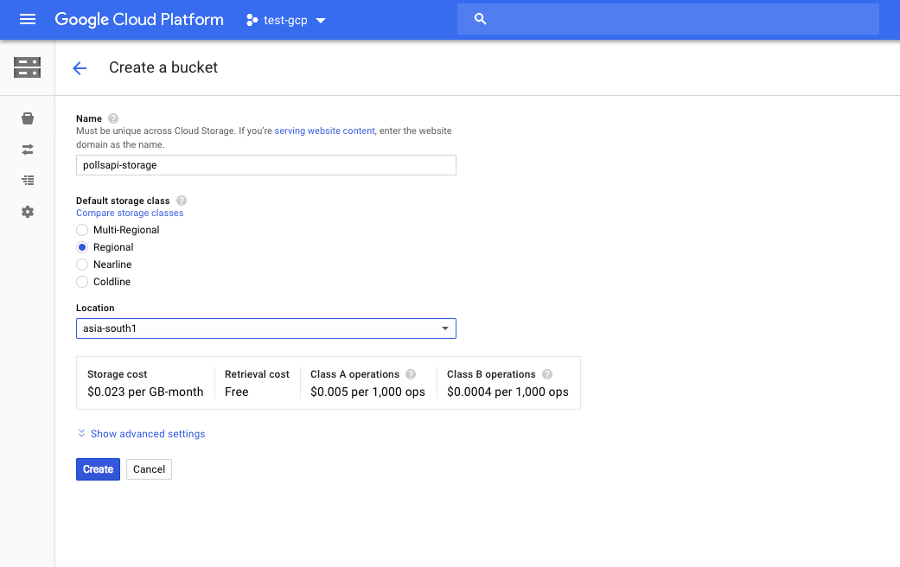

Once the bucket is created, navigate to the settings icon as shown below

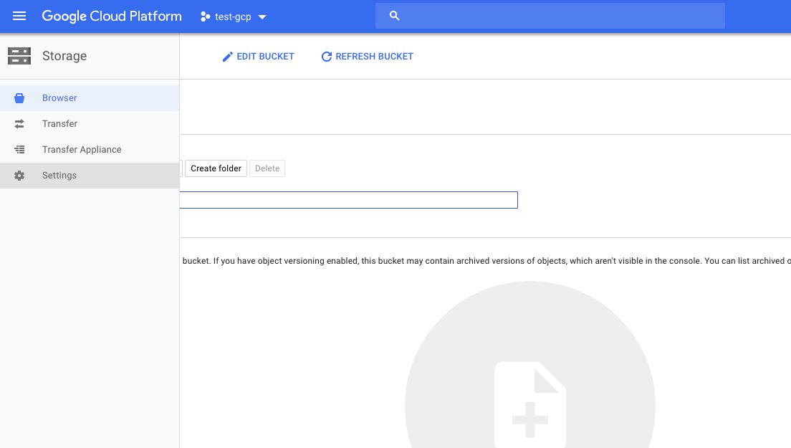

In the interoperability tab, create a new key. This key is required to
let our django application send static files to our bucket.

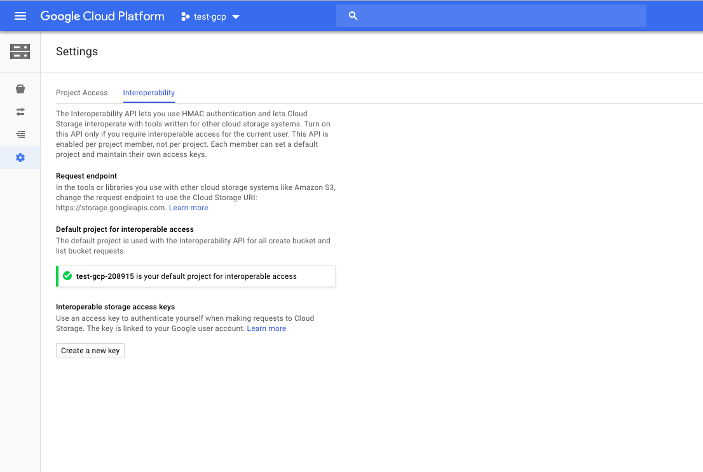

Now that we have ACCESS\_KEY, ACCESS\_SECRET and BUCKET\_NAME, lets
create a secrets file in kubernetes, so that we can directly use these
as environment variables in our django application.

.. code:: sh

    # Lets first encode our secrets into base64 format

    echo -n 'YOUR_SECRET_ACCESS_KEY_ID_HERE' | base64

    ## Repeat the same for SECRET_ACCESS_KEY and BUCKET_NAME

Once we have the three generated values, replace them in
``cloud-storage-secrets.yml``. After replacing the values with
appropriate ones, lets create our secret in kubernetes.

.. code:: sh

    # Creating cloud storage secret

    kubectl create -f cloud-storage-secrets.yml

Now that the secrets are setup sucessfully, lets run the Job
``polls-collect-static.yml`` in order to collect static files.

.. code:: sh

    kubectl create -f polls-collect-static.yml

    # Note : It will take some time to collect the static files, as they are being uploaded
    # to our bucket from the batch job which we created just now. 
    # We can just check the status of static files by either checking the logs
    # or by checking the job status itself

|image2| |image3|

We have sucessfully setup static files in our application. But the major
question is:

``How are the static files being served?``

To answer that question, lets see a small code snippet below

.. code:: py

    # First, the packages Boto & Django Storages are required. Lets install them
    # These packages help us to connect to Google Cloud Storage
    pip install boto django-storages

    # Check the following snippet now (from settings.py file under the STATIC_FILES_SETTINGS)
    DEFAULT_FILE_STORAGE = 'storages.backends.gs.GSBotoStorage'
    STATICFILES_STORAGE = 'storages.backends.gs.GSBotoStorage'

    GS_ACCESS_KEY_ID = os.environ.get('GS_ACCESS_KEY_ID', None)
    GS_SECRET_ACCESS_KEY = os.environ.get('GS_SECRET_ACCESS_KEY', None)
    GS_BUCKET_NAME = os.environ.get('GS_BUCKET_NAME', None)

    # Here we are configuring Google Cloud Storage as our default storage provider.
    # So whenever we run python manage.py collectstatic, all the static files
    # will be uploaded/updated in our Google Cloud Storage.
    # This also makes sure that all the static files (when required), will be served
    # from the location specified.

    # GS_ACCESS_KEY_ID, GS_SECRET_ACCESS_KEY and GS_BUCKET_NAME are the environment
    # variables which were created in `cloud-storage-secrets.yml` and are passed to our 
    # application when the yaml file has been created.

Setting up Django Application
~~~~~~~~~~~~~~~~~~~~~~~~~~~~~

Now that we have the database ready with migrations, collected
staticfiles, lets start our application.

.. code:: sh

    # Start application
    kubectl create -f pollsapi.yml

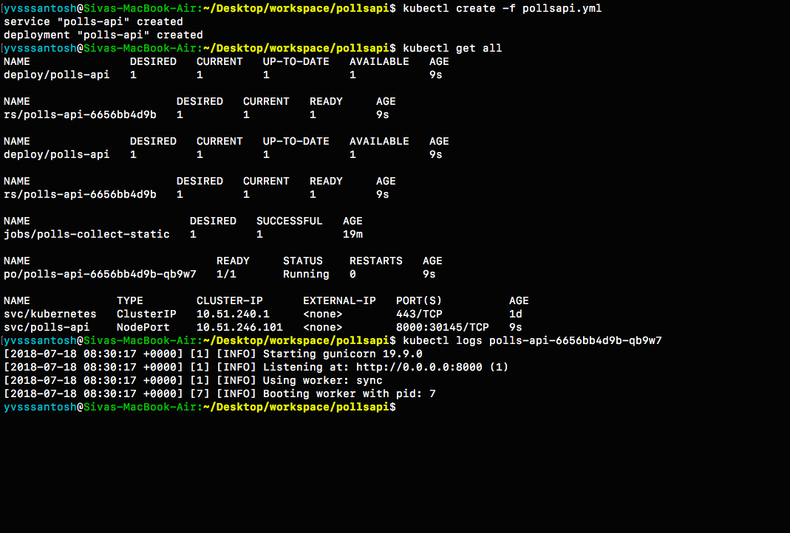

``Note:`` 1. Usually, we run the server using
``python manage.py runserver``. This is ``NOT RECOMMENDED`` for
production purposes because of security concerns and extra memory usage.
More on this can be found
`here <https://docs.djangoproject.com/en/2.0/howto/deployment/wsgi/gunicorn/>`__
Keeping that in mind, this tutorial uses ``gunicorn`` server to run the
application.

2. The service type is NodePort for our application, which means that
   we'll be able to access our application once we expose it using an
   Ingress.

Exposing our Application
~~~~~~~~~~~~~~~~~~~~~~~~

Lets create an Ingress to expose our application.

.. code:: sh

    kubectl create -f pollsapi-ingress.yml

``Note that creating an ingress may take atleast 5 minutes, or sometimes even more. Please be patient while an ingress is being created``

To check the status of the ingress, see below |image4|

As expected, it took around ``10 minutes`` for the ingress to setup
properly. Navigate to the ingress address generated i.e.
http://35.241.42.232/ in order to access our application.

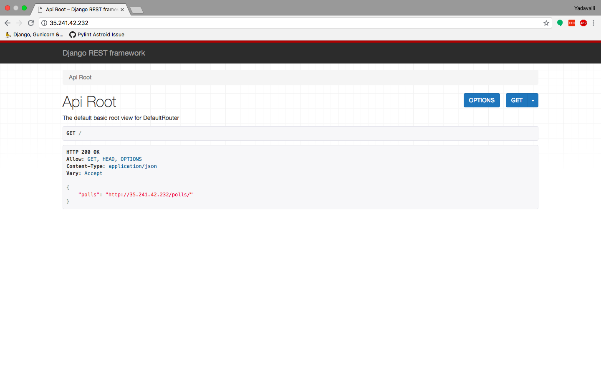

Documentation for Polls API
~~~~~~~~~~~~~~~~~~~~~~~~~~~

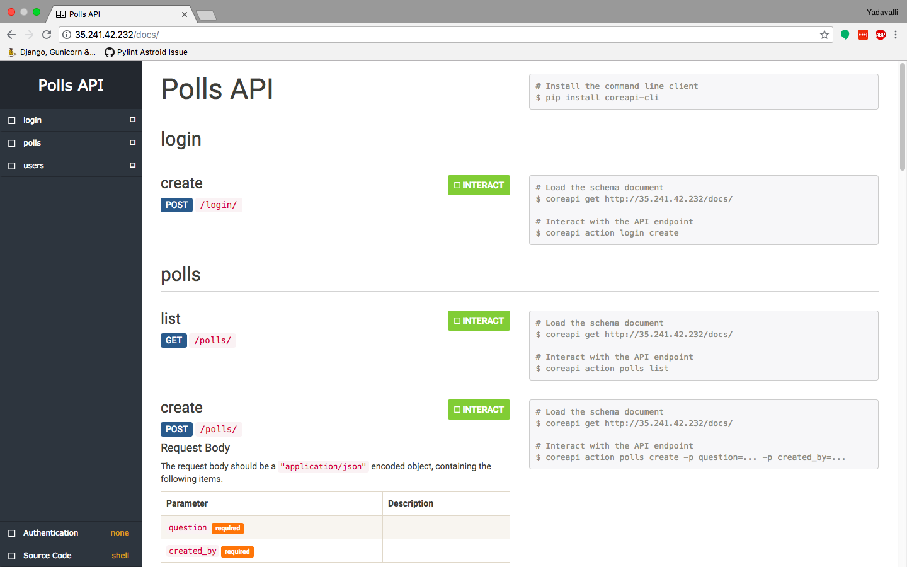

For any queries, please create a new issue `here <https://github.com/yvsssantosh/django-on-k8s/issues/new>`__

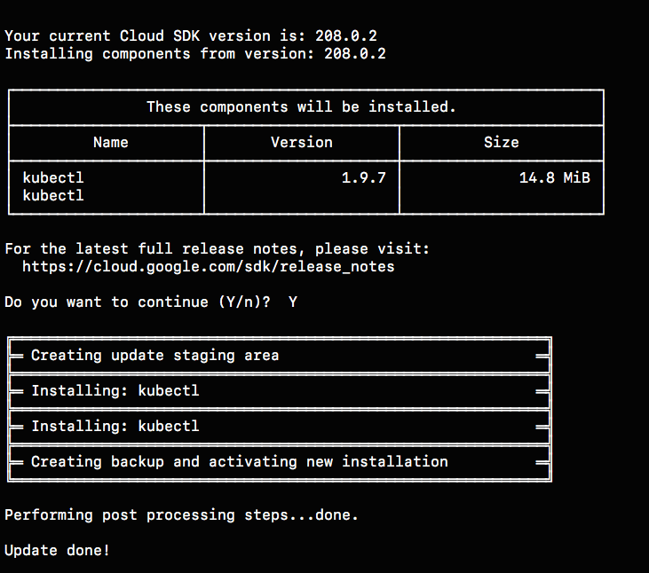
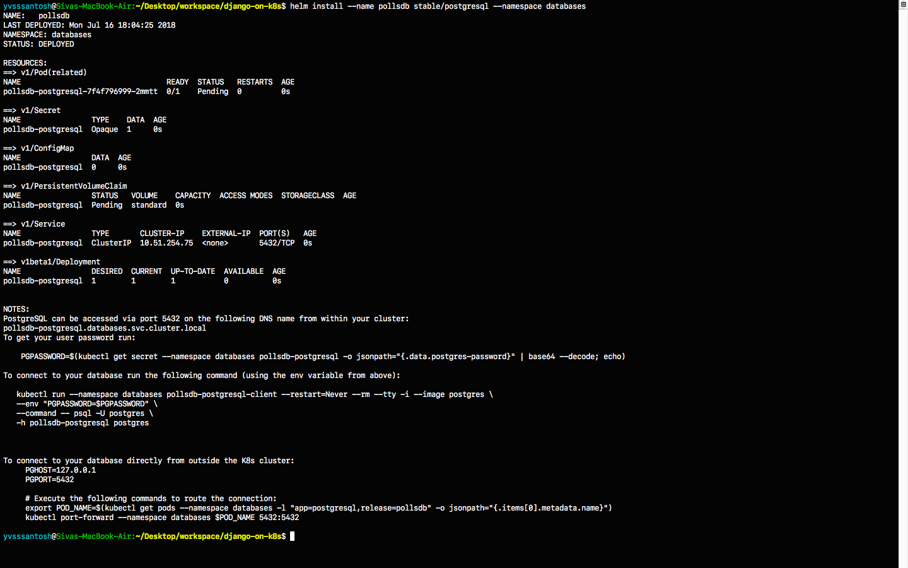
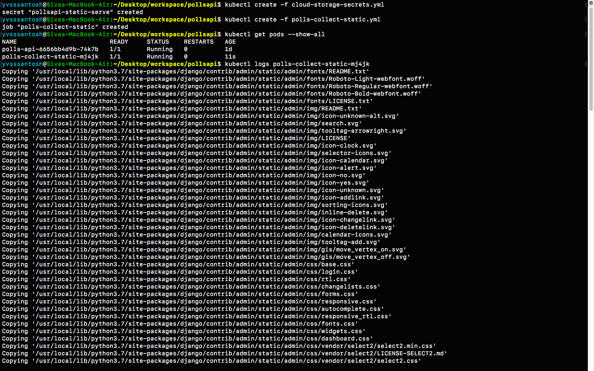
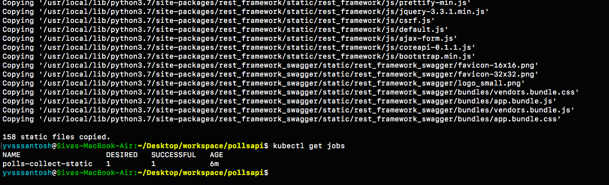
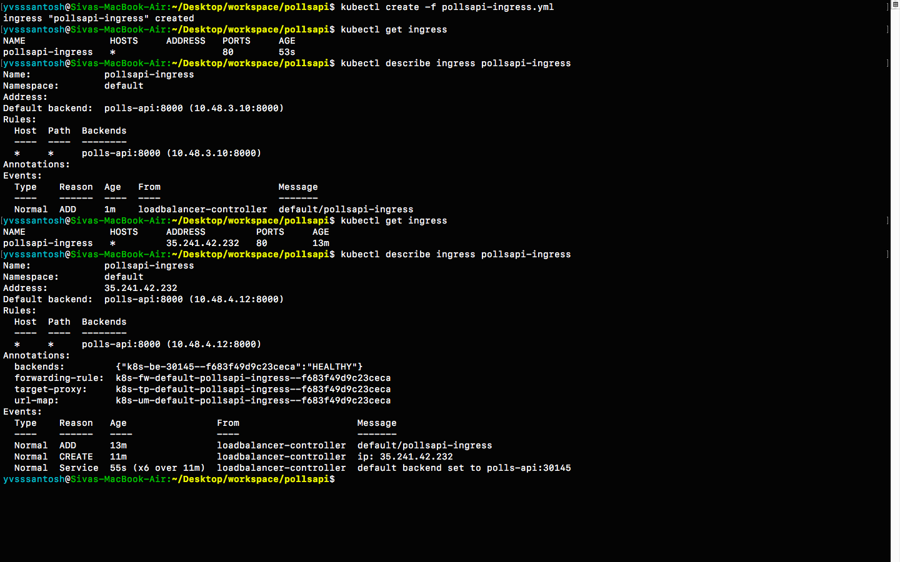
