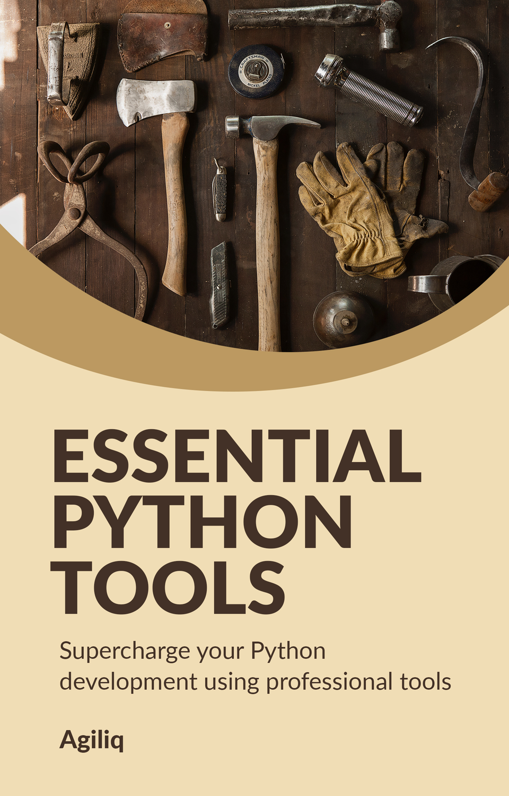

.. Essential Python Tools documentation master file, created by
   sphinx-quickstart on Sun Jul 15 21:21:17 2018.
   You can adapt this file completely to your liking, but it should at least
   contain the root `toctree` directive.

Essential Python Tools
==========================

.. toctree::
   :maxdepth: 2
   :caption: Table of Contents:

   repl_and_debugging
   linters
   environment_management
   code_management
   documentation
   deployment

Indices and tables
==================

* :ref:`genindex`
* :ref:`modindex`
* :ref:`search`
