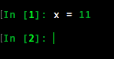
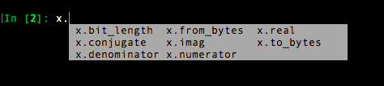
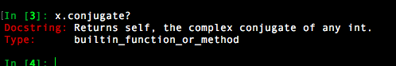
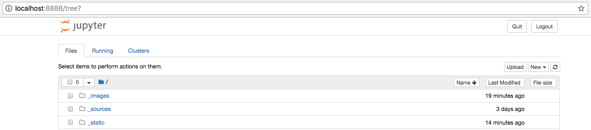

Interactive environments and debugging
------------------------------------------

Ipython
++++++++
`IPython <https://ipython.org/>`_ (Interactive Python) is a command shell for interactive computing in python, originally developed to make python easy and interactive, it offers introspection, rich media, shell syntax, tab completion, and history.

.. IPython is actually a python interpreter. It improves exploration, debugging, and optimization of the python code.

You can install Ipython via pip( :code:`pip install ipython` ) but we suggest installing IPython using the `Python Anaconda distribution <https://www.anaconda.com/download/>`_. 

Anaconda is an open-source Python distribution which provides us with many python tools. When installed, Anaconda includes: core Python language, IPython, Jupyter Notebook and many data-science packages.

To use Ipython

.. code-block:: python

    $ ipython

IPython has more features than python like Syntax highlighting, Proper Intendation,

**Syntax highlighting**

    

**Tab-completion**
 

    

**Documentation** can be viewed by putting a :code:`?` after the command.

Jupyter
++++++++
`Jupyter Notebook <http://jupyter.org/>`_  is a open source application for writing and sharing code and text.
It is one of the popular data science tool in python.

.. The Jupyter Notebook is a web application that allows us to create documents that contain executable code, formulas and equations, data visualizations, rich text editor, improved graphical capabilities and many other features.

It has replaced IPython notebook, which initially supported only python but now later started supporting many languages. IPython notebooks was started to make working with python easy and interactive. IPython provides python backend (also known as kernel) for Jupyter

If you installed Python using Anaconda, then you have the Jupyter Notebook installed. To start the notebook

.. code-block:: python

    $ jupyter notebook

After starting Jupyter notebook, we'll notice that a tab will open in a web browser open. It will run the Jupyter Notebook on a local port, such as http://localhost:8888. It will list out the contents of the system in a directory format. To create new "notebooks" just click "New" and then selecting the python version.

 Using Jupyter Notebook we can create shareable files that can support live code, charts, graphs, math, different forms of markup (Markdown, etc.), and much more.

**To know more about 'Jupyter Notebook' check** - http://jupyter-notebook.readthedocs.io/en/stable/

pdb and ipdb
++++++++++++++

pdb
=====

`pdb <https://docs.python.org/3/library/pdb.html>`_ is a debugging tool that is part of python's standard library. It is an interactive source code debugger for Python programs.

Using pdb, we can set `breakpoints <https://en.wikipedia.org/wiki/Breakpoint>`_ at any point of our program to stop it and check for errors or the status of our running program.

    **pbd help speed up the debugging process a lot faster than using simple print() statements everywhere.**

The easiest way to use pdb is to call it in the code you’re working on.

.. code-block:: python

    import pdb; pdb.set_trace()  

As soon as the interpreter reaches this line, we’ll receive a command prompt on the terminal where we’re running the program. This is a general Python prompt, but with some new commands.

   + l (list) - Display 11 lines around the current line.
   + r (return) - Continue execution until the current function returns.
   + b (break) - Set a breakpoint (depending on the argument provided).
   + n (next) - Continue execution until the next line in the current function is reached.
   + s (step) - Execute the current line, stop at the first possible occasion.
   + j (jump) - Jump to the next line to be executed.
   + c (continue) - Creates a breakpoint in the program execution.

for more commands `check <https://docs.python.org/3/library/pdb.html#debugger-commands>`_

If we want to run the application from the debugger and set breakpoints without any changes in the source code, then we need to execute the application with the debugger, use the command 

.. code-block:: python
    
    $ python -m pdb hello.py

ipdb
=====

ipdb, the Ipython-enabled python debugger, with all pdb’s features and adds ipython support for the interactive shell, like tab completion, color support, magic functions and more. We can use ipdb just as we use pdb.

